## Coding Activity

- In this activity, you’ll examine how to develop a smart contract with Solidity by using the [Remix IDE](https://remix.ethereum.org/), one of the tools dedicated to implementing contracts to the Ethereum network.

- You’ll develop a smart contract for basic banking operations.

- You’ll learn sending ETH between any account and the contract developed (from an account to a contract or from a contract to an account) and how to restrict the people who can use the relevant function of the smart contract.

### Getting Started

- You'll develop a smart contract that includes all of the functionalities and capabilities Solidity presents, or at least most of them.

- There are several methods to develope a smart contract. Of these methods, you’ll use Remix IDE, a powerful open-source tool that provides the ability to develop a smart contract from a browser.

- First, let’s open Remix IDE from a browser and create a new file with the extension .sol. We’ll use this for our Solidity code here.

### Declaring the Contract

- Declare a contract beside the Solidity version you want to use.

```js
pragma solidity >=0.8.2 <0.9.0;
contract BankContract { }
```

- Define the State Variables, Data Types, and Data Structures

- Create a client object to keep the client’s information, which will join the contract by using the `struct` element. It keeps the client’s ID, address, and balance in the contract.

- Create an array in the `client_account` type to keep the information of all of our clients.

```js
pragma solidity >=0.8.2 <0.9.0;
contract BankContract {
    struct client_account{
        int client_id;
        address client_address;
        uint client_balance_in_ether;
    }
    client_account[] clients;
}
```

- Assign an ID to each client whenever they join the contract, so define an `int` counter and set it to 0 in the constructor of the contract.

```js
pragma solidity >=0.8.2 <0.9.0;
contract BankContract {
    struct client_account{
        int client_id;
        address client_address;
        uint client_balance_in_ether;
    }
    client_account[] clients;
    int clientCounter;
    constructor() public{
        clientCounter = 0;
    }
}
```

- Now define an `address` variable for the manager and a `mapping` to keep the last interest date of each client.

- You'll want to estrict the time required to send interest again to any account, it’ll be used to check whether enough time has elapsed.

```js
pragma solidity >=0.8.2 <0.9.0;
contract BankContract {
    struct client_account{
        int client_id;
        address client_address;
        uint client_balance_in_ether;
    }
    client_account[] clients;
    int clientCounter;
    address payable manager;
    mapping(address => uint) public interestDate;
    constructor() public{
        clientCounter = 0;
    }
}
```

### Implement the Modifiers

- Restrict the people that can call the relevant method or you may want to allow the execution of the method only specific circumstances. In these kinds of circumstances, the `modifier` checks the condition you’ve implemented, and it determines whether the relevant method should be executed.

- Before implementing all of the methods we need to organize the smart contract, we have to implement two modifiers. Both methods will check the people who call the relevant method and which of the modifiers is used. One of them determines whether the sender is the manager, and the other one determines whether the sender is a client.

```js
pragma solidity >=0.8.2 <0.9.0;
contract BankContract {
    struct client_account{
        int client_id;
        address client_address;
        uint client_balance_in_ether;
    }
    client_account[] clients;

    int clientCounter;
    address payable manager;
    mapping(address => uint) public interestDate;
    constructor() public{
        clientCounter = 0;
    }
    modifier onlyManager() {
        require(msg.sender == manager, "Only manager can call!");
        _;
    }

    modifier onlyClients() {
        bool isClient = false;
        for(uint i=0;i<clients.length;i++){
            if(clients[i].client_address == msg.sender){
                isClient = true;
                break;
            }
        }
        require(isclient, "Only clients can call!");
        _;
    }
}
```

### Implement the Fallback Function

- The fallback function is essential to making the contract receive ether from any address.

- The `receive` keyword is new in Solidity `0.6.x`, and it’s used as a `fallback function` to receive ether.

- Since we’ll receive ether from the clients as a deposit, we need to implement the `fallback function`.

```js
pragma solidity >=0.8.2 <0.9.0;
contract BankContract {
    struct client_account{
        int client_id;
        address client_address;
        uint client_balance_in_ether;
    }
    client_account[] clients;

    int clientCounter;
    address payable manager;
    mapping(address => uint) public interestDate;
    constructor() public{
        clientCounter = 0;
    }
    modifier onlyManager() {
        require(msg.sender == manager, "Only manager can call!");
        _;
    }

    modifier onlyClients() {
        bool isClient = false;
        for(uint i=0;i<clients.length;i++){
            if(clients[i].client_address == msg.sender){
                isClient = true;
                break;
            }
        }
        require(isclient, "Only clients can call!");
        _;
    }
    receive() external payable { }
}
```

### Develop the Methods

- Develop the following methods:

- The `setManager` method will be used to set the manager address to variables. The `managerAddress` is consumed as a parameter and cast as payable to provide sending ether.

```js
function setManager(address managerAddress) public returns(string memory){
     manager = payable(managerAddress);
     return "";
}
```

- The `joinAsClient` method will be used to make sure the client joins the contract. Whenever a client joins the contact, their interest date will be set, and the client information will be added to the client array.

```js
function joinAsClient() public payable returns(string memory){
     interestDate[msg.sender] = now;
     clients.push(client_account(clientCounter++, msg.sender, address(msg.sender).balance));
     return "";
}
```

- The deposit method will be used to send ETH from the client account to the contract. Make this method callable only by clients who’ve joined the contract, so the `onlyClient` modifier is used for this restriction.

> The transfer methods belongs to the contract, and it’s dedicated to sending an indicated amount of ETH between addresses. The payable keyword makes receipt of the ETH transfer possible, so the amount of ETH indicated in the `msg.value` will be transferred to the contract address.

```js
function deposit() public payable onlyClients{
     payable(address(this)).transfer(msg.value);
}
```

- The `withdraw` method will be used to send ETH from the contract to the client account. It sends the unit of ETH indicated in the amount parameter, from the contract to the client who sent the transaction.

- Make `withdraw` method to be callable only by clients who’ve joined the contract either, so the `onlyClient` modifier is used for this restriction.

> The address of the sender is held in the `msg.sender` variable.

```js
function withdraw(uint amount) public payable onlyClients{
     msg.sender.transfer(amount * 1 ether);
}
```

- The `sendInterest` method will be used to send ETH as interest from the contract to all clients.

- Make `sendInterest` method to be callable only by the manager, so the `onlyManager` modifier is used for this restriction. Here, the last date when the relevant client takes the interest will be checked for all of the clients, and the interest will be sent if the specific time period has elapsed.

- Finally, the new interest date is reset for the relevant client into the `interestDate` array if the new interest is sent.

```js
function sendInterest() public payable onlyManager{
     for(uint i=0;i<clients.length;i++){
          address initialAddress = clients[i].client_address;
          uint lastInterestDate = interestDate[initialAddress];
          if(now < lastInterestDate + 10 seconds){
               revert("It's just been less than 10 seconds!");
          }
          payable(initialAddress).transfer(1 ether);
          interestDate[initialAddress] = now;
     }
}
```

- The `getContractBalance` method will be used to get the balance of the deployed contract.

```js
function getContractBalance() public view returns(uint){
     return address(this).balance;
}
```

### The Final State of the Smart Contract

- Final contract

```js
pragma solidity >=0.8.2 <0.9.0;

contract BankContract {

    struct client_account{
        int client_id;
        address client_address;
        uint client_balance_in_ether;
    }

    client_account[] clients;

    int clientCounter;
    address payable manager;
    mapping(address => uint) public interestDate;

    modifier onlyManager() {
        require(msg.sender == manager, "Only manager can call this!");
        _;
    }

    modifier onlyClients() {
        bool isclient = false;
        for(uint i=0;i<clients.length;i++){
            if(clients[i].client_address == msg.sender){
                isclient = true;
                break;
            }
        }
        require(isclient, "Only clients can call this!");
        _;
    }

    constructor() public{
        clientCounter = 0;
    }

    receive() external payable { }

    function setManager(address managerAddress) public returns(string memory){
        manager = payable(managerAddress);
        return "";
    }

    function joinAsClient() public payable returns(string memory){
        interestDate[msg.sender] = now;
        clients.push(client_account(clientCounter++, msg.sender, address(msg.sender).balance));
        return "";
    }

    function deposit() public payable onlyClients{
        payable(address(this)).transfer(msg.value);
    }

    function withdraw(uint amount) public payable onlyClients{
        msg.sender.transfer(amount * 1 ether);
    }

    function sendInterest() public payable onlyManager{
        for(uint i=0;i<clients.length;i++){
            address initialAddress = clients[i].client_address;
            uint lastInterestDate = interestDate[initialAddress];
            if(now < lastInterestDate + 10 seconds){
                revert("It's just been less than 10 seconds!");
            }
            payable(initialAddress).transfer(1 ether);
            interestDate[initialAddress] = now;
        }
    }

    function getContractBalance() public view returns(uint){
        return address(this).balance;
    }
}
```

### Compile the Smart Contract

- Now compile it onto the Remix IDE. As it seems in the following image, we have the `BankContract.sol` file, and there are two more sections you’ll use:

  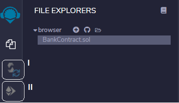

- The section represented with I is the Solidity Compiler, which you use in this section to test smart contract.

- The section represented with II is Deploy & Run Transactions, which you’ll use in the section below after compiling it.

- Compile the smart contract that is represented with I in the image above.

- Select the compiler version according to the version specified before and click the button at the bottom of the section.

  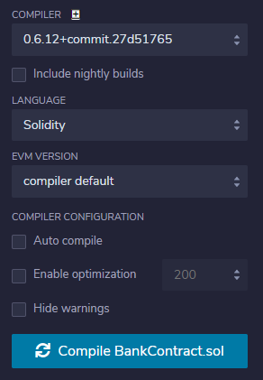

### Deploy the Smart Contract

- The following image shows the Deploy & Run Transactions section.

- The Remix IDE presents various opportunities to deploy the smart contract into various environments.

- You can deploy the smart contract in whatever environment you want with the configurations.

- Also, you can run any transaction that calls the smart contract method with the parameters you set here.

  

- In this activity, you’ll deploy contract on the **JavaScript VM** environment, so select it among the following environments.

  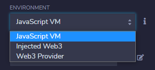

- In the accounts combo, there are many accounts ypu can use during the deploying and testing of the smart contract.

- Among these accounts that the Remix IDE presents, select the first one to deploy the contact.

  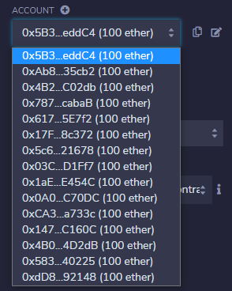

- After setting the environment and the account, deploy using the Deploy button. In the terminal section, the transaction result happens as it appears in the following image.

  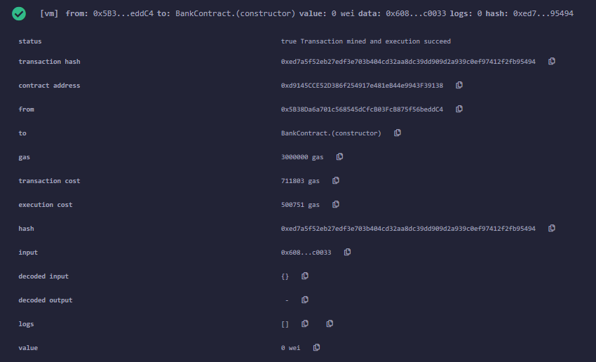

> The contract address is the address where the ETH that’s sent from clients’ accounts will be held.

- According to the result of the transaction above, the smart contract was deployed to the account selected successfully. Deploying the smart-contract operation causes a cost to the sender who deploys it. The transaction cost represents the cost required to deploy the contract — the amount placed in the transaction cost was taken from the account — as shown in the following image.

  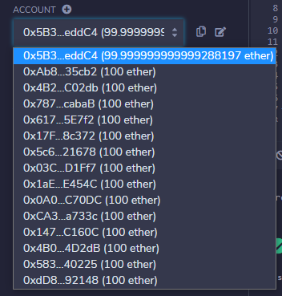

- On the other hand, the smart contract deployed can be seen in the Deployed Contracts subsection on the left.

  

### Run the Transactions

- Now call the functions that compound the smart contract developed.
- Expand the relevant contract in the Deployed Contract subsection to see the methods developed.

  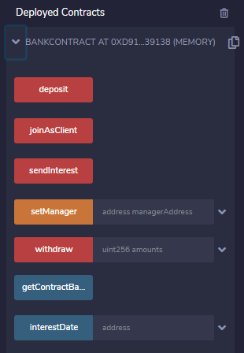

### The `setManager` method

- Set a manager. Type an address that selected from the account combo and click the yellow `setManager` button.

  

- The following output happens in the terminal. The decoded output shows the message that returned from the method, which is an empty string message — as expected.

  

### The `joinAsClient` method

- You'll continue to join as a client for three clients that were determined from the account combo and call the joinAsClient method for each one.
- At this time — and this is different from the previous one — call the method while selecting related accounts because `msg.sender` value is taken from here.

  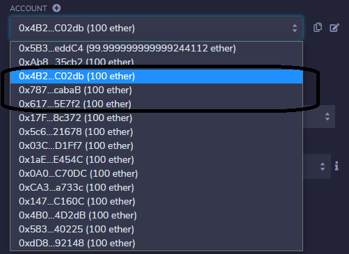

- Those three accounts were selected as a client, and then clicked the red `joinAsClient` button for each one.

- After these operations, the following messages show in the terminal, which mean those three accounts were set as clients in the contract. Also, a specific cost was taken from the client’s account to run the method.

  

  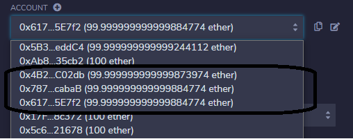

### The deposit method

- To send 10 ETH from the clients’ accounts to the contract by using the `deposit` method where you'll take the amount declared in the `msg.value` from the sender that’s represented in the `msg.sender` variable.


- Hence, set q`10 ETH` and call the `deposit` method by clicking the red `deposit` button for each client account, like you did before for the `joinAsClient` method.

- After these operations, the following messages show in the terminal, which means those three accounts sent `10 ETH` from their account to the contract address. Also, the final state of the accounts’ balances look like this:


### The `getContractBalance` method

- Now, call the `getContractBalance` method to check whether the 30 ETH that was sent from the clients exist in the contract account. Click the blue `getContractBalance` button, and it returns an amount that corresponds to 30 ETH in Wei.

  

- Differing from the methods applied so far, this method just returns a value without changing any state variables. Hence, it was executed with no cost, and the warning in the terminal seems a bit different.

  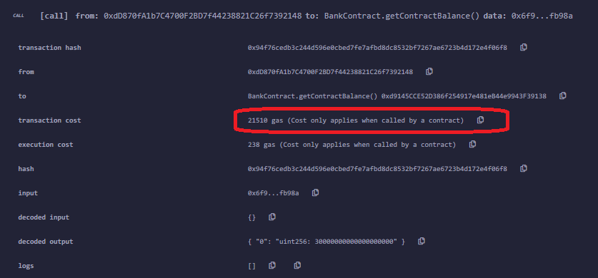

### The `sendInterest` method

- After checking that the contract isn’t empty anymore, send interest to your clients by calling the `sendInterest` method.

- Select the account that have been set as manager account before and click the red `sendInterest` button.

  

- The message in the image above appears after calling the method in the terminal.
- This message means that 1 ETH was sent to each client’s account successfully. We can see the balance of each client increased from 89 to 90 ETH after this operation.

  

- Implement a restriction that checks whether 10 seconds have elapsed since the `sendInterest` method was called.

- To check this control, call the same method one more time in 10 seconds. The transaction went as expected, and the "It’s just been less than 10 seconds!" message appeared in the terminal, as in the image below.

  

### The `withdraw` method

- Call the last method to withdraw an amount from the contract to the client’s account.

- In the `withdraw` method, we transfer the amount declared in the `msg.value` from the account to the sender that’s represented in the `msg.sender` variable.
- At this point, there’s a problem realized, which is that the people who haven’t joined the contract as a client can call this method too. Using the onlyClient modifier avoids this problem.

- When selecting an account belonging to anyone who hasn’t joined the contract as a client and then call the withdraw method through the red `withdraw` button, the "Only clients can call this!" is displayed:

  

- If selecting anyone who’s joined the contract and click the red `withdraw` button, the amount of the sender will increase from 90 to 99 ETH.

  
  

- After calling the method, the ETH amount increased as expected.

  

- There is 31,830 Wei missing in the last amount, which corresponds to the transaction cost that should be taken from the sender account for executing the transaction.

- Looking at the transaction detail in the terminal, you can see the exact same amount as the transaction cost.

  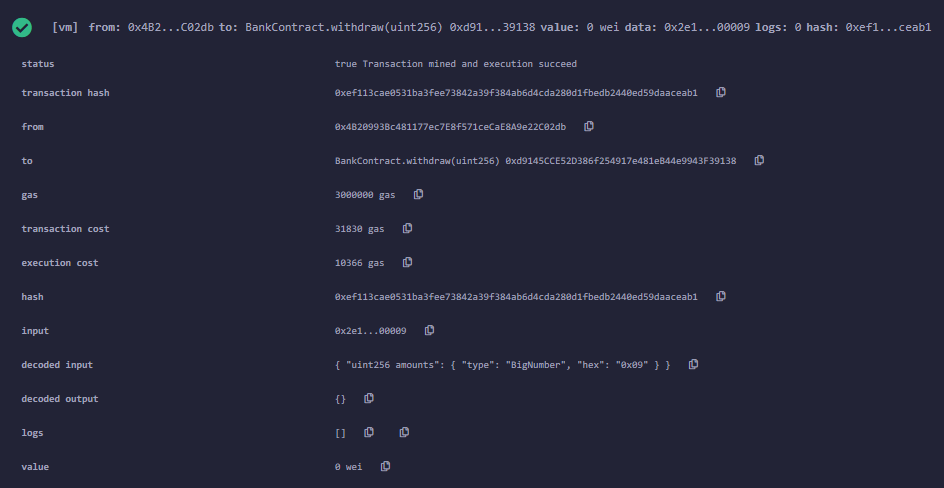

- After these operations, only 18 ETH is supposed to be remaining in the contract address because a total of 12 ETH has been sent from the contract (3 ETH as interest and 9 ETH as a withdrawal).

- Calling the `getContractBalance` method, gets following result:

  

- In this activity, you developed a smart contract that allows for the implementation of all of the elements that compounds most of Solidity.

- You also compiled and deployed it on the Remix IDE.

- Finally, you tested all of the functionalities it presents through the methods it has by simulating a process.
