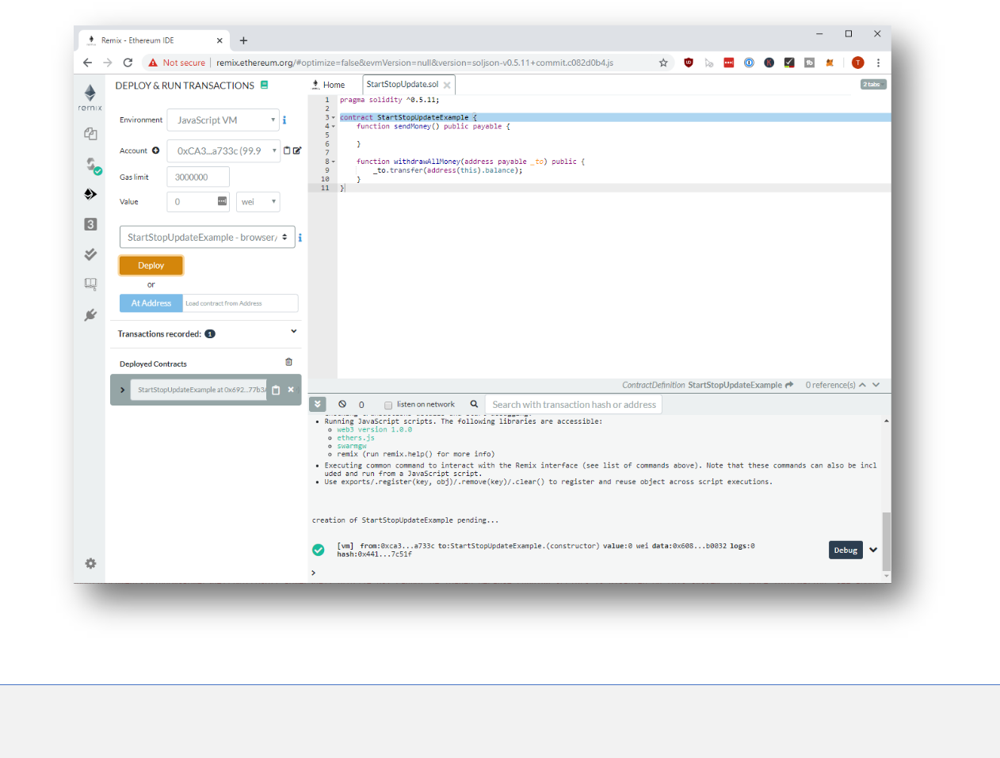
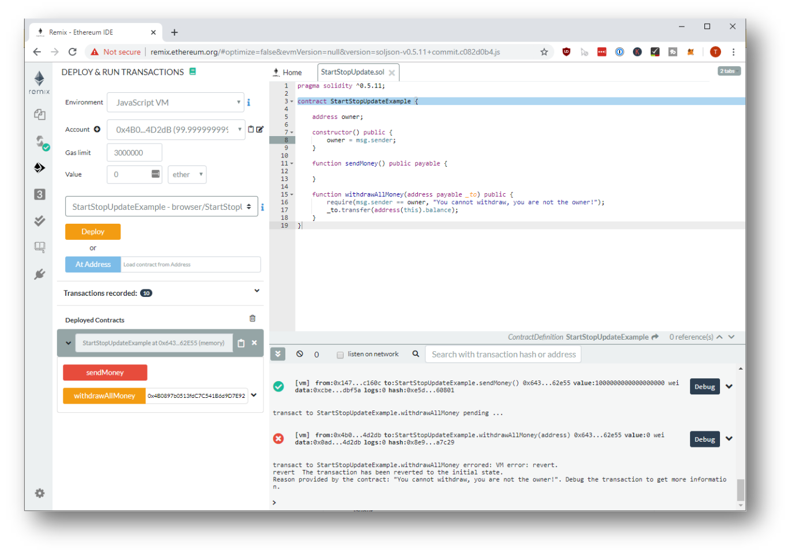
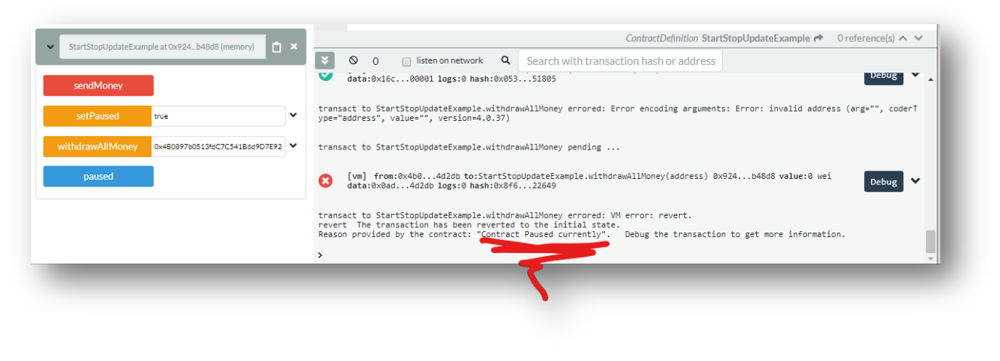
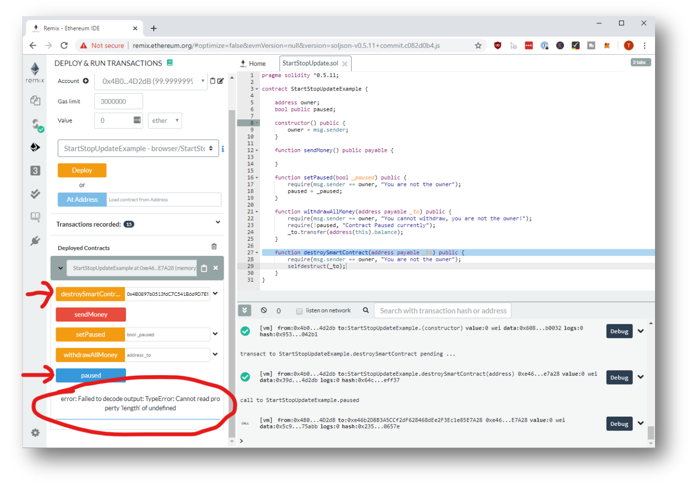

# Coding Activity - 1

Starting, Pausing and Stopping Smart Contracts

## Prerequisites

1. Chrome or Firefox browser.
2. An Internet connection
3. Open Remix with the following Smart Contract:

```js
// SPDX-License-Identifier: MIT

pragma solidity >=0.8.2 <0.9.0;

contract StartStopUpdateExample {
    function sendMoney() public payable {
    }

    function withdrawAllMoney(address payable _to) public {
        _to.transfer(address(this).balance);
    }
}
```

## Step by Step Instruction

### Deploy the Smart Contract in the JavaScript VM

- Open the **Deploy and Run Transactions** view in Remix with the smart contract



### Send some money to the Smart Contract


### Copy the address of the second account


### Withdraw the Money


- This isn’t very secure, is it? Let’s add some checks…

### Update the Smart Contract

```js
// SPDX-License-Identifier: MIT

pragma solidity >=0.8.2 <0.9.0;

contract StartStopUpdateExample {
    address owner;

    constructor() {
        owner = msg.sender;
    }

    function sendMoney() public payable {
    }

    function withdrawAllMoney(address payable _to) public {
        require(msg.sender == owner, &quot;You cannot withdraw!&quot;);
        _to.transfer(address(this).balance);
    }
}
```

### Try to send and withdraw money again

> Note: Don’t forget to re-deploy the smart contract.

1. Deploy the Smart Contract using the first account in your account list
2. Send 1 Ether to your smart contract
3. Select and Copy the second account from your account list
4. Try to use the withdraw method using the second account from your account list
5. Switch back to your first account
6. See if you can withdraw now.

This time you can see that you can send money from any account. But you can use the withdraw method only from the account which deployed the smart contract. Observe the Logs-Output:



### Pause a Smart Contract

- With these new powers we got, it is easy to add a **pause** functionality. Let’s take the following code:

```js
// SPDX-License-Identifier: MIT

pragma solidity >=0.8.2 <0.9.0;

contract StartStopUpdateExample {
    address owner;
    bool public paused;

    constructor() {
        owner = msg.sender;
    }

    function sendMoney() public payable {
    }

    function setPaused(bool _paused) public {
        require(msg.sender == owner, &quot;You are not the owner&quot;);
        paused = _paused;
    }

    function withdrawAllMoney(address payable _to) public {
        require(msg.sender == owner, &quot;You cannot withdraw”);
        require(!paused, &quot;Contract Paused currently&quot;);
        _to.transfer(address(this).balance);
    }
}
```


### Try to withdraw money

- It won’t work and show you an error message. The contract is paused.



### Add a destroy functionality to the Smart Contract

- Consider the following source code:

```js
// SPDX-License-Identifier: MIT

pragma solidity >=0.8.2 <0.9.0;

contract StartStopUpdateExample {
    address owner;
    bool public paused;

    constructor() {
        owner = msg.sender;
    }

    function sendMoney() public payable {
    }

    function setPaused(bool _paused) public {
        require(msg.sender == owner, "You are not the owner");
        paused = _paused;
    }

    function withdrawAllMoney(address payable _to) public {
        require(msg.sender == owner, "You cannot withdraw!");
        require(!paused, "Contract Paused currently");
        _to.transfer(address(this).balance);
    }

    function destroySmartContract(address payable _to) public {
        require(msg.sender == owner, "You are not the owner");
        selfdestruct(_to);
    }
}
```

### Stop the Smart Contract

- Now deploy the new smart contract. Then copy your account address. Paste it into the **destroySmartContract** Input field. Hit the button, and then try to interact with the smart contract. It won’t work.



# Coding Activity - 2

Error Handling in Solidity

Prerequisites

1. Chrome or Firefox browser.
2. An Internet connection
3. Open Remix with the following Smart Contract:

```js
// SPDX-License-Identifier: MIT

pragma solidity >=0.8.2 <0.9.0;

contract ExceptionExample {
    mapping(address => uint) public balanceReceived;

    function receiveMoney() public payable {
        balanceReceived[msg.sender] += msg.value;
    }

    function withdrawMoney(address payable _to, uint _amount) public {
        if(_amount &lt;= balanceReceived[msg.sender]) {
        balanceReceived[msg.sender] -= _amount;
        _to.transfer(_amount);
        }
    }
}
```

## Step by Step Instruction

### Deploy the Smart Contract in the JavaScript VM

- Open the **Deploy and Run Transactions** view in Remix with the smart contract

### Try to withdraw more than you have

- At the beginning you have 0 Ether. When we try to withdraw some then simply nothing happens.


### Replace the if with a Require

```js
// SPDX-License-Identifier: MIT

pragma solidity >=0.8.2 <0.9.0;

contract ExceptionExample {
    mapping(address => uint) public balanceReceived;

    function receiveMoney() public payable {
        balanceReceived[msg.sender] += msg.value;
    }

    function withdrawMoney(address payable _to, uint _amount) public {
        require(_amount &lt;= balanceReceived[msg.sender], &quot;not enough funds.&quot;);
        balanceReceived[msg.sender] -= _amount;
        _to.transfer(_amount);
    }
}
```

- And try to withdraw again. It should throw an error!


### Add an Assert

- Imagine your balance is not of the type `uint256`, but of the type `uint64` – to save some storage costs.
- If you send two times 10 Ether to your smart contract it will automatically roll over to 0:

```js
// SPDX-License-Identifier: MIT

pragma solidity >=0.8.2 <0.9.0;

contract ExceptionExample {

    mapping(address => uint64) public balanceReceived;

    function receiveMoney() public payable {
        balanceReceived[msg.sender] += uint64(msg.value);
    }

    function withdrawMoney(address payable _to, uint _amount) public {
        require(_amount <= balanceReceived[msg.sender], "not enough funds.");
        balanceReceived[msg.sender] -= uint64(_amount);
        _to.transfer(_amount);
    }
}
```


- It is lower, because the uint64 rolls over to 0 after reaching the maximum value of 18446744073709551616 – that’s around 18.44 Ether
- Here we could use asserts to make sure we don’t roll over – in both directions!
- When withdrawals happen, we don’t suddenly have more balance available than before and when deposits happen that the balance after depositing is really higher than before.

### Add an assert, to make sure the balance can only grow larger

```js
// SPDX-License-Identifier: MIT

pragma solidity >=0.8.2 <0.9.0;

contract ExceptionExample {
    mapping(address => uint64) public balanceReceived;

    function receiveMoney() public payable {
        assert(balanceReceived[msg.sender] + uint64(msg.value) >= balanceRecei
        ved[msg.sender]);
        balanceReceived[msg.sender] += uint64(msg.value);
    }

    function withdrawMoney(address payable _to, uint _amount) public {
        require(_amount <= balanceReceived[msg.sender], "not enough funds.");
        assert(balanceReceived[msg.sender] >= balanceReceived[msg.sender] - _amount);
        balanceReceived[msg.sender] -= uint64(_amount);
        _to.transfer(_amount);
    }
}
```

### test again

- Send again 2 times 10 Ether to the smart contract. It will end in an error.


