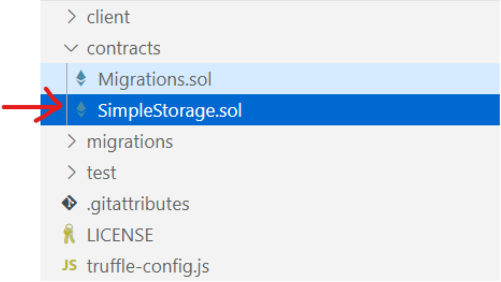
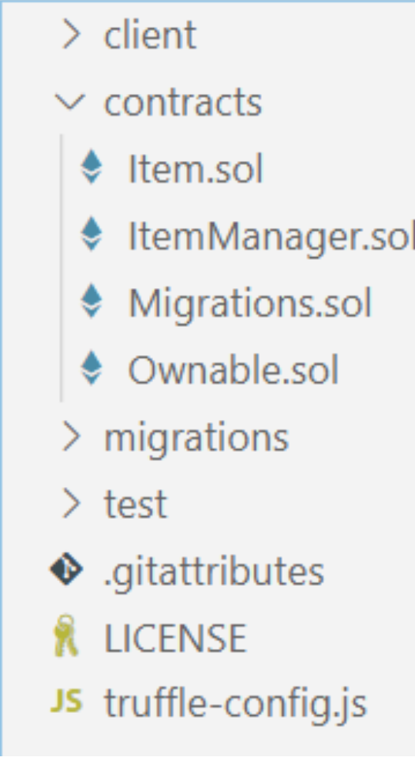
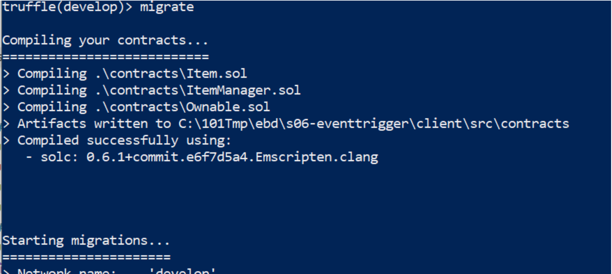
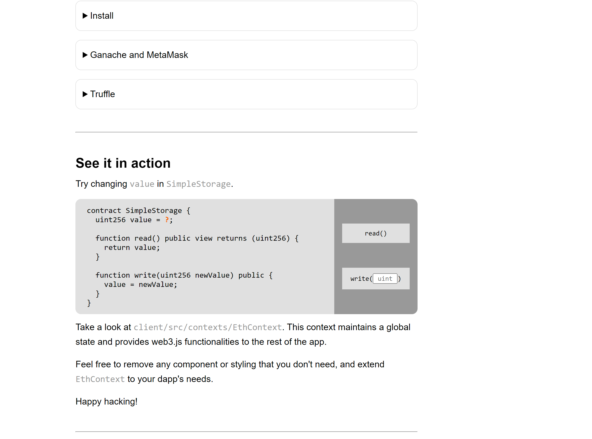
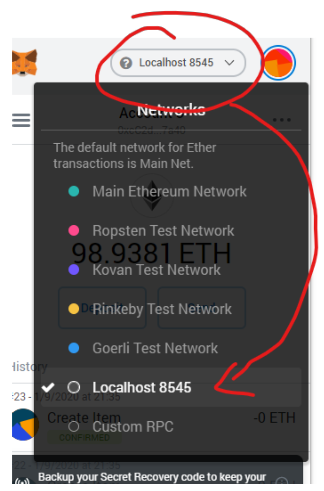
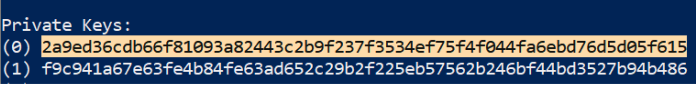
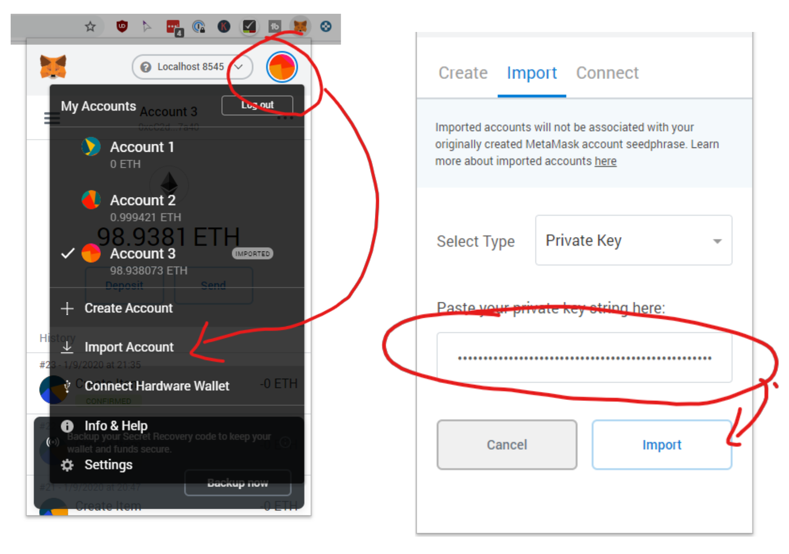

# supply-chain-dapp

## In this assignment, you will be building a real-world Supply chain decentralized application by following the steps:

### Step 1:

The first thing we need is a Management Smart Contract, where we can add items.

`ItemManager.sol`

```js
// SPDX-License-Identifier: MIT

pragma solidity ^0.6.10;

contract ItemManager{
    enum SupplyChainSteps{Created, Paid, Delivered}

    struct S_Item {
        ItemManager.SupplyChainSteps _step;
        string _identifier;
        uint _priceInWei;
    }

    mapping(uint => S_Item) public items;
    uint index;

    event SupplyChainStep(uint _itemIndex, uint _step);

    function createItem(string memory _identifier, uint _priceInWei) public {
        items[index]._priceInWei = _priceInWei;
        items[index]._step = SupplyChainSteps.Created;
        items[index]._identifier = _identifier;
        emit SupplyChainStep(index, uint(items[index]._step));
        index++;
    }

    function triggerPayment(uint _index) public payable {
        require(items[index]._priceInWei <= msg.value, "Not fully paid");
        require(items[index]._step == SupplyChainSteps.Created, "Item is further in the supply chain");
        items[_index]._step = SupplyChainSteps.Paid;
        emit SupplyChainStep(_index, uint(items[_index]._step));
    }

    function triggerDelivery(uint _index) public {
    require(items[_index]._step == SupplyChainSteps.Paid, "Item is further in the supply chain");
    items[_index]._step = SupplyChainSteps.Delivered;
    emit SupplyChainStep(_index, uint(items[_index]._step));
    }
}
```

Its purpose is to add items and pay them, move them forward in the supply chain and trigger a delivery. Instead, we can just give the user a simple address to send money to.

### Step 2:

Add another contract called `Item.sol`

`Item.sol`

```js
// SPDX-License-Identifier: MIT

pragma solidity ^0.6.10;

import "./ItemManager.sol";
contract Item {
    uint public priceInWei;
    uint public paidWei;
    uint public index;
    ItemManager parentContract;
    constructor(ItemManager _parentContract, uint _priceInWei, uint _index) public {
        priceInWei = _priceInWei;
        index = _index;
        parentContract = _parentContract;
    }

    receive() external payable {
        require(msg.value == priceInWei, "We don't support partial payments");
        require(paidWei == 0, "Item is already paid!");
        paidWei += msg.value;
        (bool success, ) = address(parentContract).call.value(msg.value)(abi.encodeWithSignature("triggerPayment(uint256)", index));
        require(success, "Delivery did not work");
    }

    fallback () external {
    }
}
```

And change the ItemManager Smart Contract to use the Item Smart Contract instead of the `struct` only:

```js
// SPDX-License-Identifier: MIT

pragma solidity ^0.6.10;

import "./Item.sol";

contract ItemManager {
    struct S_Item {
    Item _item;
    ItemManager.SupplyChainSteps _step;
    string _identifier;
    }

    mapping(uint => S_Item) public items;
    uint index;
    enum SupplyChainSteps {Created, Paid, Delivered}

    event SupplyChainStep(uint _itemIndex, uint _step, address _address);

    function createItem(string memory _identifier, uint _priceInWei) public {
        Item item = new Item(this, _priceInWei, index);
        items[index]._item = item;
        items[index]._step = SupplyChainSteps.Created;
        items[index]._identifier = _identifier;
        emit SupplyChainStep(index, uint(items[index]._step), address(item));
        index++;
    }

    function triggerPayment(uint _index) public payable {
        Item item = items[_index]._item;
        require(address(item) == msg.sender, "Only items are allowed to update themselves");
        require(item.priceInWei() == msg.value, "Not fully paid yet");
        require(items[index]._step == SupplyChainSteps.Created, "Item is further in the supply chain");
        items[_index]._step = SupplyChainSteps.Paid;
        emit SupplyChainStep(_index, uint(items[_index]._step), address(item));
    }

    function triggerDelivery(uint _index) public {
        require(items[_index]._step == SupplyChainSteps.Paid, "Item is further in the supply chain");
        items[_index]._step = SupplyChainSteps.Delivered;
        emit SupplyChainStep(_index, uint(items[_index]._step), address(items[_index]._item));
    }
}
```

Now with this, we just have to give a customer the address of the Item Smart Contract created during createItem and he will be able to pay directly by sending X wei to the Smart Contract. But the smart contract isn’t very secure yet. We need some sort of owner functionality.

### Step 3:

Add `onlyOwner` Modifiers and `Ownable` Functionality.
You could add the OpenZeppelin Smart Contracts with the Ownable Functionality.

`Ownable.sol`

```js
// SPDX-License-Identifier: MIT

pragma solidity ^0.6.10;

contract Ownable {
    address public _owner;

    constructor () internal {
        _owner = msg.sender;
    }

    /**
    * @dev Throws if called by any account other than the owner.
    */
    modifier onlyOwner() {
        require(isOwner(), "Ownable: caller is not the owner");
        _;
    }

    /**
    * @dev Returns true if the caller is the current owner.
    */
    function isOwner() public view returns (bool) {
        return (msg.sender == _owner);
    }
}
```

Modify `ItemManager.sol` by adding an `Ownable` contract.

```js
// SPDX-License-Identifier: MIT

pragma solidity ^0.6.10;

import "./Ownable.sol";
import "./Item.sol";

contract ItemManager is Ownable {
    //...
    function createItem(string memory _identifier, uint _priceInWei) public onlyOwner {
        //...
    }
    function triggerPayment(uint _index) public payable {
        //...
    }

    function triggerDelivery(uint _index) public onlyOwner {
        //...
    }

    // ....
}
```

### Step 4:

Installing truffle and unboxing the project
If you do not have installed truffle globally then Run

```sh
$ npm install -g truffle ganache
```

Create a directory called module7_assignment go inside that directory using

```sh
$ cd ./module7_assignment
```

Unbox the react project running following command

```sh
$ truffle unbox react
```

This command should download a repository and install all dependencies in the current folder. Open the project in your favourite IDE. We will be showing the steps assuming [Visual Studio Code](https://code.visualstudio.com/).

### Step 5:

Now you’ll add the contracts created in previous steps and remove `SimpleStorage.sol`.



And add the files created previously:



Now modify the migration file:

`1_Migrations.js`

```js
const ItemManager = artifacts.require("./ItemManager.sol");
module.exports = function (deployer) {
  deployer.deploy(ItemManager);
};
```

Modify the `truffle-config.js` file to lock in a specific compiler version:

`truffle-config.js`

```js
const path = require("path");
module.exports = {
  // See <http://truffleframework.com/docs/advanced/configuration>
  // to customize your Truffle configuration!
  contracts_build_directory: path.join(__dirname, "../client/src/contracts"),
  networks: {
    development: {
     host: "127.0.0.1",     // Localhost (default: none)
     port: 8545,            // Standard Ethereum port (default: none)
     network_id: "*",       // Any network (default: none)
    },
  }, 
  compilers: {
    solc: {
      version: "0.8.18",
    },
  },
};
```

On the terminal run:

```sh
$ ganache
$ truffle migrate
```


### Step 6:

- Modify the React app component that includes the Demo/Contract.jsx

```js
    <code>
      {`contract ItemManager {
  `}


    </code>
    //.. more code here ...
```

Update the contexts\ethContext\EthProvider.jsx and change line 33 from importing the simpleStorage.json to importing the truffle/client/src/contracts itemManager.json

```js


modify the contractbtns.jsx file to add two functions:

* CreateItem
* TriggerPayment

These functions should call the smart contract and create the item or trigger the payment.


Open another terminal (leave the one running) and go to the client folder and run
```sh
$ npm start
```
This will start the development server on port 3000 and should open a new tab in your browser:



> Do not worry about the error message that the network wasn’t found or the contract wasn’t found under the address provided. Follow along in the next step where you change the network in MetaMask! As long as there is no error in your terminal and it says “Compiled successfully” you’re good to go.

### Step 7:
Connect Metamask and add Private key to MetaMask

First, connect with MetaMask to the right network.



- When we migrate the smart contracts with Truffle Developer console, then the first account in the truffle developer console is the “owner”.
- So, either we disable MetaMask in the Browser to interact with the app or we add in the private key from truffle developer console to MetaMask.
- In the Terminal/Powershell where Truffle Developer Console is running scroll to the private keys on top:



Copy the Private Key and add it into MetaMask:



- Then your new Account should appear here with ~100 Ether in it.


Step 8: 

Listen to payments

Now that you know how much to pay to which address you need some sort of feedback. Obviously, you don’t want to wait until the customer tells you that he paid, you want to know right on the spot if a payment happened.

There are multiple ways to solve this particular issue. For example, you could poll the Item smart contract.

You could watch the address on a low-level for incoming payments. We will wait for the event “SupplyChainStep” to trigger with _step == 1 (Paid). Let’s add another function to the ContractBtns component that will listen to that event.


use the subscribe function outlined here: https://web3js.readthedocs.io/en/v1.2.11/web3-eth-subscribe.html#web3-eth-subscribe


Step 9:

Create an Item then trigger a payment

Your assignment is completed. Zip the truffle project and submit to the dropbox. Do not include the `node_modules` folder in the zip else you’ll receive 0 (but you can resubmit).
